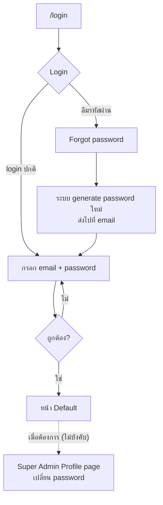
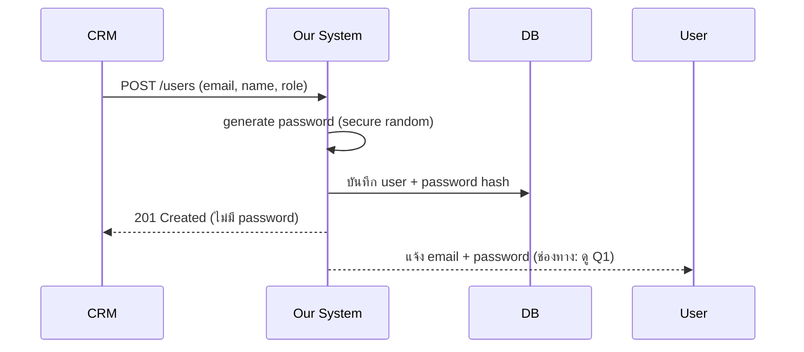
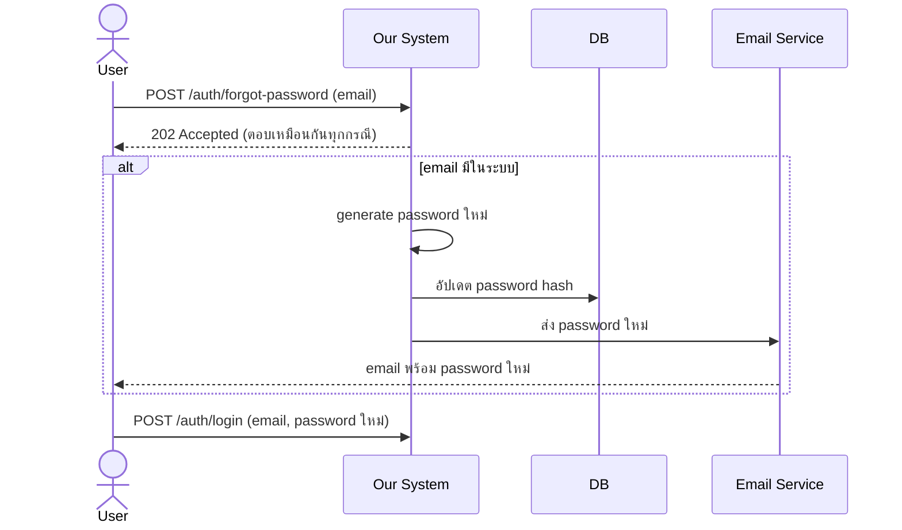
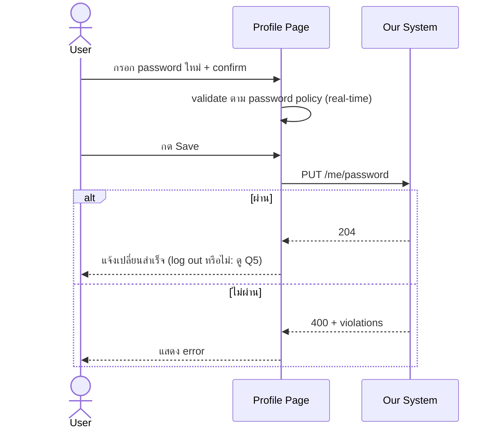

# Login Flow Diagrams

- **Last updated:** 2026-10-04
- **ต้นฉบับ:** Excalidraw (แนบลิงก์ไฟล์ต้นฉบับที่นี่)

> Diagram เขียนด้วย Mermaid แสดงผลได้ใน GitHub, GitLab, VS Code (ติดตั้ง extension Markdown Preview Mermaid)

## 1. ภาพรวม Flow หน้า /login

## 2. สร้าง User ผ่าน CRM

## 3. Forgot Password

## 4. เปลี่ยน Password ที่ Profile Page

## หมายเหตุ

Flow ต้นฉบับมีส่วนที่เป็นสีจาง (popup บังคับเปลี่ยนรหัสหลัง login ครั้งแรก
และ log out หลัง save) diagram ข้างบนวาดตามการตัดสินใจล่าสุดใน ADR-0003
ซึ่งเลือก Profile page แทน popup ถ้าทีมยืนยันว่าส่วนสีจางยังอยู่ใน scope ต้องแก้ diagram นี้ (ดู Q4)
