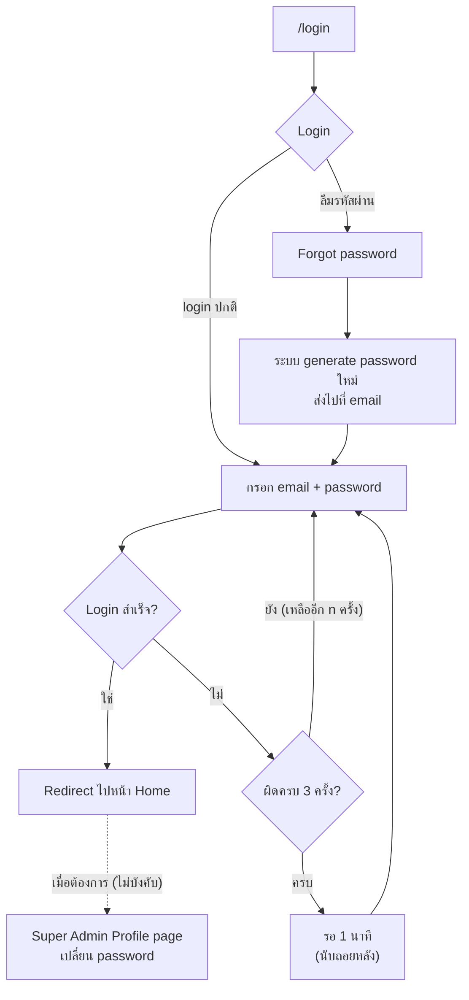
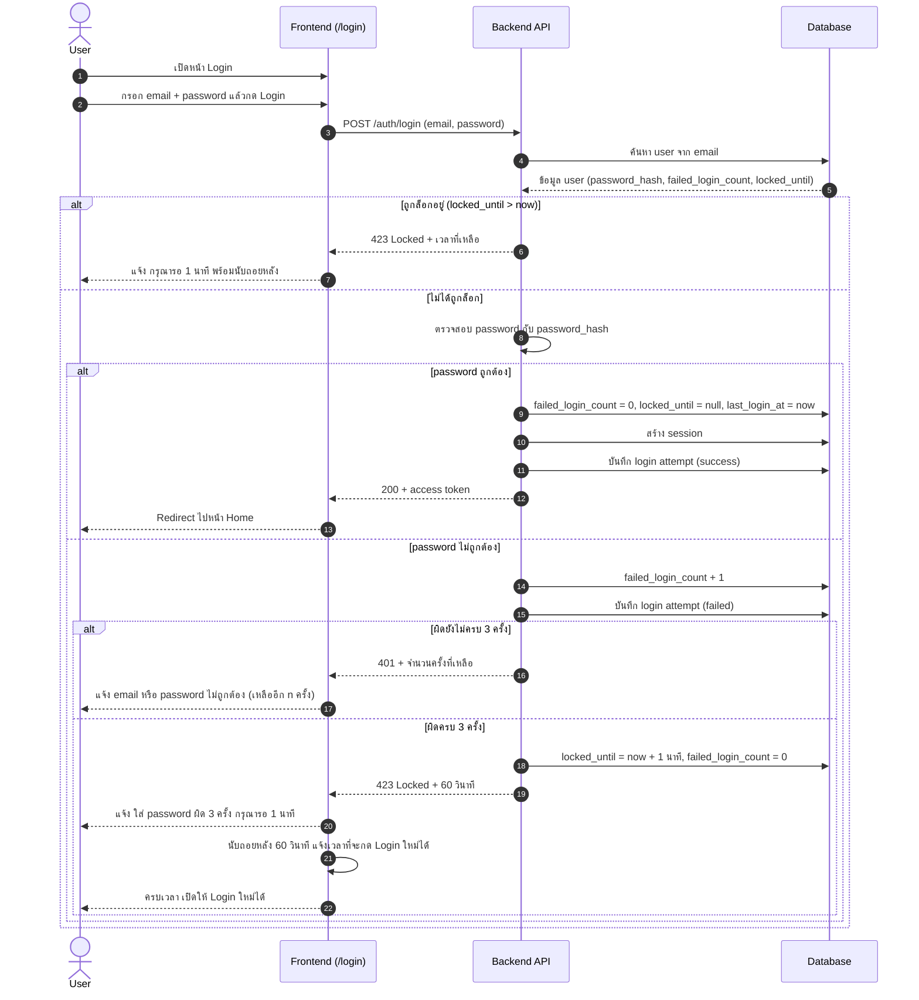
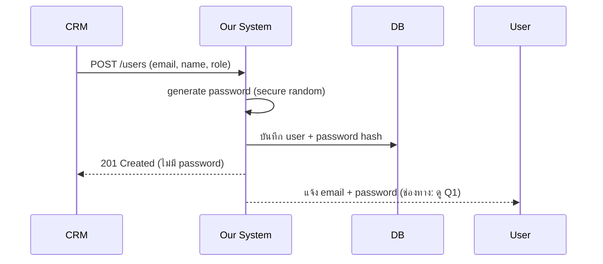
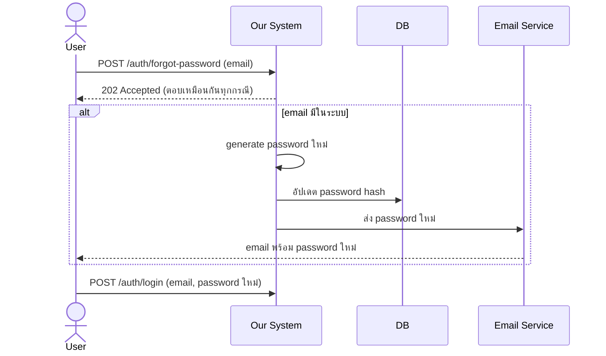
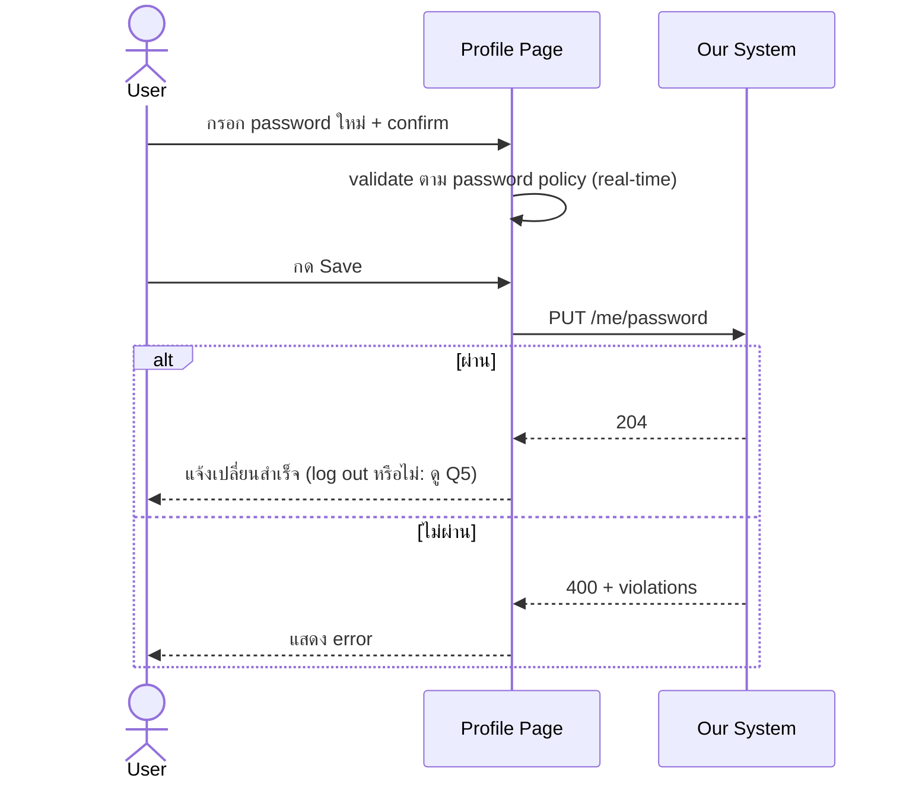

# Login Flow Diagrams

- **Last updated:** 2026-10-09
- **ต้นฉบับ:** Excalidraw (แนบลิงก์ไฟล์ต้นฉบับที่นี่)

> Diagram เขียนด้วย Mermaid แสดงผลได้ใน GitHub, GitLab, VS Code (ติดตั้ง extension Markdown Preview Mermaid)

## 1. ภาพรวม Flow หน้า /login

ล็อกบัญชี 1 นาทีเมื่อใส่ password ผิดครบ 3 ครั้ง ดู [ADR-0012](../adr/0012-change-flow-login.md)

## 2. Login และการล็อกบัญชีชั่วคราว

## 3. สร้าง User ผ่าน CRM

## 4. Forgot Password

## 5. เปลี่ยน Password ที่ Profile Page

## หมายเหตุ

Flow ต้นฉบับมีส่วนที่เป็นสีจาง (popup บังคับเปลี่ยนรหัสหลัง login ครั้งแรก
และ log out หลัง save) diagram ข้างบนวาดตามการตัดสินใจล่าสุดใน ADR-0011
ซึ่งเลือก Profile page แทน popup ถ้าทีมยืนยันว่าส่วนสีจางยังอยู่ใน scope ต้องแก้ diagram นี้ (ดู Q4)
